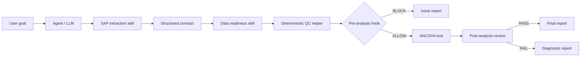

# Biomedical pipeline: project breakdown

The workshop question is: **Is BIO-ABC-101 ready for its primary efficacy analysis? If readiness checks pass, run the specified ANCOVA.** The task is a fictional teaching example using the supplied SAP and CSVs.

## How the pieces fit

The harness coordinates the flow. Shared state records the contract, selected inputs, QC evidence, decisions, results, and provenance. A separate pre-tool hook checks protected-file operations before the controlled workflow dispatches them. Reporting includes review of the draft text before release.

| Piece | What it contributes | Example |
| --- | --- | --- |
| User request | The objective and selected inputs | Check readiness, then analyze only if allowed |
| Agent / LLM | Uses the procedures and interprets source evidence | Reads the SAP through the extraction skill |
| Skill | A reusable procedure, input requirements, and output expectations | `skills/data-checker/SKILL.md` |
| Helper / tool | Deterministic computation | `check_sap_contract_against_data()` |
| Hook | An executable check at a controlled boundary | `require_qc_allow()` before fitting |
| State | Evidence carried between stages | Contract, QC table, result, manifest |
| Harness | Calls components in order and handles their decisions | Workflow script and workflow skill |

## Supplied analysis and the two branches

The supplied SAP names HBA1C change at Week 24, FAS subjects with `FASFL = Y`, the model `CHG = TRT01P + BASE`, and the contrast ABC-201 minus Placebo. Its no-imputation rule requires missing endpoint subjects to be counted. Confidence level and some inference settings are not specified; prompt 09 explicitly chooses and labels workshop settings.

The supplied `adsl.csv` has ten FAS subjects. `adeff_results.csv` contains Baseline and Week 12 observations, so it cannot supply the Week 24 endpoint. `adeff_week24_pass.csv` contains Baseline and Week 24 observations for those subjects. These are inspected input properties, not results of a newly executed pipeline. The second file remains a candidate pass case until all checks run.

The tutorial's build prompts require complete usable FAS endpoint coverage as a conservative workshop gate policy. This choice is explicit because the SAP also permits missing-record exclusion and counting. A learner should preserve both the source statement and the policy rather than silently conflate them.

## Existing reference and rebuild additions

The reference project was inspected read-only. The following distinctions keep the breakdown faithful while allowing the prompts to request a stronger, clearer rebuild.

| Topic | Existing reference | What the construction prompts request |
| --- | --- | --- |
| SAP extraction | A deterministic parser tailored to this Markdown excerpt; some values are matched specifically | Explicit supported format, numbered readiness items, ambiguity handling, evidence/schema validation |
| Shared utilities | Hashing, JSON loading, timestamps, and artifact descriptions are repeated across files | Optional consolidation in `state_helpers.py` and explicit per-run state |
| Protected sources | A Python decision hook checks classified operations against `data/`; the workflow invokes it for declared reads | Also protect SAP; reject unrecognized operations, enforce through the dispatcher, test path handling |
| Readiness | Required variables, population, treatments, visit, and endpoint coverage checks | Add explicit duplicate, numeric, and consistency checks with documented tolerances |
| Pre-analysis gate | `require_qc_allow()` primarily checks the summary decision string | Revalidate current inputs and QC; prove the fit function is never called on blocked paths |
| ANCOVA | NumPy OLS with SciPy t inference and a fixed 95% interval | Explicit workshop settings, stable solve, supported-model validation, full-precision state |
| Result review | Contract, gate, file hashes, numerical sanity, and optional report keyword checks | Stronger reconciliation, contextual claim review, exact draft-to-final correspondence |
| Reporting | Reviews an optional supplied narrative; no automatic narrative builder | A new `reporting_helpers.py` with completed, blocked, and diagnostic branches |
| Harness | Calls scripts and records artifact decisions; failures can stop before manifest creation | Reliable failure manifests, explicit semantic gates, report generation and release handling |

These are application-level controls. Merely adding a hook file does not install a provider's global lifecycle hook or create an operating-system sandbox. The inspected Python harness itself does not call a hosted LLM. The agent uses the workflow skill to invoke the deterministic tools.

## Component cards and construction order

## 01. Define the project and its boundaries

Give the coding agent a clear goal, build order, and rules for preserving the supplied inputs.

- **Role:** Project setup
- **Inputs:** The workshop goal; SAP.md and the supplied data/ folder
- **Outputs:** project_protocol.md (ignored by Git); .gitignore; A small, ordered implementation plan
- **Functions:** No executable helper in this step.
- **Reference / scope:** Project protocol and Git exclusions; setup material.
- **Learner prompt:** [Copy prompt 01](prompts/01-project-protocol.txt)

**What to inspect:** The plan follows the diagram; source files are unchanged; the protocol is ignored; no pipeline components have been built by this prompt yet.

## 02. Create the SAP extraction skill

Teach the agent a reusable procedure for turning the analysis plan into explicit, source-supported requirements.

- **Role:** Skill
- **Inputs:** SAP.md
- **Outputs:** skills/sap-extractor/SKILL.md; A documented contract field structure
- **Functions:** No executable helper in this step.
- **Reference / scope:** skills/sap-extractor/SKILL.md
- **Learner prompt:** [Copy prompt 02](prompts/02-sap-skill.txt)

**What to inspect:** The skill separates extraction from readiness and defines how unknowns and source evidence are represented.

## 03. Build the extraction helper and contract

Make the supplied Markdown excerpt reproducibly extractable and the resulting contract machine-checkable.

- **Role:** Helper + state artifact
- **Inputs:** SAP.md; The SAP skill's field specification
- **Outputs:** extract_sap_contract.py; A contract schema and validation helper; output/sap_analysis_contract.json
- **Functions:** `split_sections`, `find_section`, `bullet_value`, `code_or_text_formula`, `bullets_after_phrase`, `all_bullets`, `evidence`, `field`, `extract_contract`, `validate_contract (proposed)`
- **Reference / scope:** skills/sap-extractor/scripts/extract_sap_contract.py; stronger validation is a rebuild requirement.
- **Learner prompt:** [Copy prompt 03](prompts/03-contract-helper.txt)

**What to inspect:** The contract identifies Week 24, HBA1C, FASFL = Y, CHG = TRT01P + BASE, and ABC-201 minus Placebo; unsupported extraction cannot silently pass.

## 04. Add shared state and provenance helpers

Let every stage identify the exact inputs and artifacts it is using.

- **Role:** Helpers + state
- **Inputs:** Input files; Generated JSON artifacts
- **Outputs:** state_helpers.py (proposed); A documented per-run manifest structure
- **Functions:** `sha256_file`, `utc_now`, `load_json`, `artifact`, `write_json (proposed)`
- **Reference / scope:** sha256_file, utc_now, load_json, and artifact exist across the demo; a shared state_helpers.py is a proposed consolidation.
- **Learner prompt:** [Copy prompt 04](prompts/04-shared-state.txt)

**What to inspect:** A changed input produces a different fingerprint; source destinations are rejected; hashes are not described as signatures or proof of trust.

## 05. Create the source-data protection hook

Check proposed file operations before the controlled workflow executes them.

- **Role:** Pre-tool hook
- **Inputs:** A structured proposed tool operation; Protected source paths
- **Outputs:** hooks/pre_tool_data_security_hook.py; ALLOW/BLOCK decision with reasons
- **Functions:** `run_pre_tool_data_security_hook`, `collect_path_candidates`, `resolve_candidate`, `is_inside_or_equal`, `command_has_mutating_pattern`
- **Reference / scope:** hooks/pre_tool_data_security_hook.py; enforcement depends on the dispatcher calling the hook.
- **Learner prompt:** [Copy prompt 05](prompts/05-data-protection-hook.txt)

**What to inspect:** The controlled dispatcher can reject a protected-source mutation before execution; declaring a policy in prose alone is insufficient.

## 06. Create the data readiness skill

Tell the agent which evidence to request and how to interpret the deterministic QC output.

- **Role:** Skill
- **Inputs:** Validated SAP contract; Explicitly selected subject and efficacy files
- **Outputs:** skills/data-checker/SKILL.md
- **Functions:** `check_sap_contract_against_data (to be called by the skill)`
- **Reference / scope:** skills/data-checker/SKILL.md
- **Learner prompt:** [Copy prompt 06](prompts/06-readiness-skill.txt)

**What to inspect:** The skill requires an explicit dataset choice and explains failure without trying to repair the source files.

## 07. Build deterministic data QC

Turn analysis requirements into a term-by-term checking table and an explicit decision.

- **Role:** Helper + CLI
- **Inputs:** Contract; Subject DataFrame; Efficacy DataFrame
- **Outputs:** data_qc_helpers.py; run_data_checker.py; data_checker_table.csv / .json; data_checker_summary.json
- **Functions:** `_load_contract`, `_value`, `_source`, `_clean_values`, `_unique_values`, `_parse_equality_filter`, `_row`, `check_sap_contract_against_data`, `make_summary`
- **Reference / scope:** data_qc_helpers.py and skills/data-checker/scripts/run_data_checker.py; additional numerical and duplicate checks are rebuild requirements.
- **Learner prompt:** [Copy prompt 07](prompts/07-qc-helper.txt)

**What to inspect:** The Week 12 file has zero qualifying Week 24 records and ten missing FAS endpoints; a candidate pass file must earn its decision through checks.

## 08. Enforce the pre-analysis gate

Prevent model fitting when readiness evidence is absent, failed, inconsistent, or no longer matches the inputs.

- **Role:** Hook at the analysis entry point
- **Inputs:** QC table and summary; Contract; Current input identities
- **Outputs:** A reusable pre-analysis gate; A structured blocked analysis record
- **Functions:** `require_qc_allow`, `run_ancova_if_qc_passes`
- **Reference / scope:** ancova_helpers.py: require_qc_allow and run_ancova_if_qc_passes; checking current evidence is a requested strengthening.
- **Learner prompt:** [Copy prompt 08](prompts/08-pre-analysis-gate.txt)

**What to inspect:** A blocked or fabricated ALLOW summary cannot trigger fitting through the supported entry point; the no-fit assertion is behavioral.

## 09. Build the ANCOVA helper functions

Fit the specified toy model on the exact population and endpoint authorized by the gate.

- **Role:** Statistical tool
- **Inputs:** Validated contract; Verified selected data; Successful pre-analysis gate
- **Outputs:** ANCOVA helper functions; Structured completed/blocked/failed result
- **Functions:** `parse_equality_filter`, `infer_contrast_labels`, `build_analysis_dataset`, `fit_ancova_ols`, `run_ancova_if_qc_passes`
- **Reference / scope:** ancova_helpers.py
- **Learner prompt:** [Copy prompt 09](prompts/09-ancova-helper.txt)

**What to inspect:** Treatment coding and contrast direction match the contract; numerical failure produces FAILED rather than a plausible-looking result.

## 10. Wrap ANCOVA as an agent-usable skill

Give the agent a clear interface to the gated statistical tool.

- **Role:** Skill + CLI
- **Inputs:** Contract path; QC summary path; Selected CSV paths
- **Outputs:** skills/ancova-test/SKILL.md; run_ancova_test.py; ancova_result.json
- **Functions:** `run_ancova_if_qc_passes`, `find_demo_root`, `main`
- **Reference / scope:** skills/ancova-test/SKILL.md and skills/ancova-test/scripts/run_ancova_test.py
- **Learner prompt:** [Copy prompt 10](prompts/10-ancova-skill.txt)

**What to inspect:** Calling the CLI directly cannot skip readiness enforcement; blocked output contains reasons and no model estimates.

## 11. Create the post-analysis review hook

Check whether a completed result or blocked outcome can be reported consistently.

- **Role:** Post-analysis / pre-report hook
- **Inputs:** Contract; QC evidence; Analysis result; Optional draft report
- **Outputs:** hooks/final_result_review_hook.py; final_result_review.json
- **Functions:** `check_qc_gate_consistency`, `check_contract_alignment`, `check_provenance`, `verify_hash_from_result`, `check_source_data_handling`, `check_statistical_result`, `check_final_report_text`, `decide_release`, `run_final_result_review_hook`
- **Reference / scope:** hooks/final_result_review_hook.py; stronger reconciliation and context-aware report review are rebuild requirements.
- **Learner prompt:** [Copy prompt 11](prompts/11-final-review-hook.txt)

**What to inspect:** A review decision means artifact consistency for this demo; it is not clinical validation. Inconsistent results cannot be released as success.

## 12. Build the final report writer

Turn reviewed artifacts into a readable report without inventing results or hiding blocked analysis.

- **Role:** Reporting helper — proposed addition
- **Inputs:** Contract; QC findings; Analysis result; Final review decision
- **Outputs:** reporting_helpers.py (proposed); Draft report; final_report.md or issue_report.md
- **Functions:** `build_report (proposed)`, `format_result (proposed)`, `write_report (proposed)`
- **Reference / scope:** A dedicated reporting_helpers.py is a proposed addition; the existing demo can review a supplied report but does not generate one automatically.
- **Learner prompt:** [Copy prompt 12](prompts/12-report-helper.txt)

**What to inspect:** The report's branch and numbers agree with the reviewed artifacts; unreviewed draft text is not labeled final.

## 13. Connect the components with the harness

Coordinate the components, preserve decisions, and answer the user's analysis request.

- **Role:** Workflow skill + orchestrator
- **Inputs:** User goal; SAP path; Explicit subject and efficacy paths; Output directory
- **Outputs:** Workflow SKILL.md; run_biomed_analysis_workflow.py; workflow_manifest.json; Reviewed final or issue report
- **Functions:** `run_command`, `require_success`, `artifact`, `main`
- **Reference / scope:** skills/biomed-analysis-workflow/SKILL.md and scripts/run_biomed_analysis_workflow.py; explicit error manifests and report generation extend the reference.
- **Learner prompt:** [Copy prompt 13](prompts/13-harness.txt)

**What to inspect:** The harness coordinates real controls and artifacts; a normal process exit is not mistaken for a passing domain decision.

## 14. Ask for the two-branch walkthrough and checks

Give learners a concrete way to assess the components their coding agent generated.

- **Role:** Verification + learner documentation
- **Inputs:** The generated pipeline; The existing supplied fixtures
- **Outputs:** Focused acceptance tests; README walkthrough; Expected artifact inventory
- **Functions:** `Integration tests around the supported workflow entry point`
- **Reference / scope:** The two supplied efficacy datasets; a dedicated acceptance suite and walkthrough are rebuild deliverables.
- **Learner prompt:** [Copy prompt 14](prompts/14-walkthrough-checks.txt)

**What to inspect:** Learners can reproduce both branches, inspect the artifacts, and distinguish expected behavior from an observed test result.
